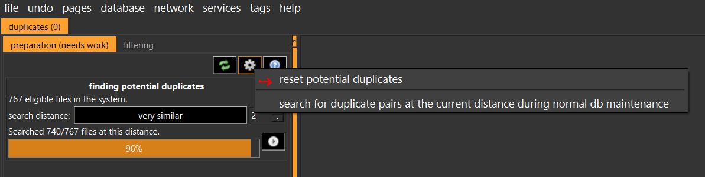

# FAQ

## How to update

```sh
pip3 install hydrusvideodeduplicator --upgrade
```

---

## How does this work?

1. First, the program will perceptually hash all your video files and store them in a database.

    - Note: Initial hashing takes longer than searching for duplicates. It will also probably get slower as it progresses because the API requests are sorted by file size.

1. Then, it will search the database for potential duplicates and mark them as potential duplicates in Hydrus.

You can run the program again when you add more files to find more duplicates.

---

## Where are the video hashes stored?

Hashes are stored in an sqlite database created in an app dir to speed up processing on subsequent runs.

On Linux, this directory is likely `~/.local/share/hydrusvideodeduplicator`

On Windows, this directory is likely `%USERPROFILE%\AppData\Local\hydrusvideodeduplicator` or `%USERPROFILE%\AppData\Roaming\hydrusvideodeduplicator`

On macos, this directory is likely `/Users/<yourusername>/Library/Application Support/hydrusvideodeduplicator`

The database directory can be set with `DEDUP_DATABASE_DIR` environment variable.

---

## I have a big library. How do I test this on just a few files?

You can use [system predicates](https://hydrusnetwork.github.io/hydrus/developer_api.html#get_files_search_files) and [queries](https://hydrusnetwork.github.io/hydrus/getting_started_searching.html) to limit your search.

Each query will reduce the number of files you process. By default all videos/animated are processed.

For example:

You want to deduplicate files with these requirements:

- Max of 1000 files

- <50 MB filesize
- In `system:archive`

- Has the tags `character:jacob`

- Imported < 1 hour ago

Then the arguments for the query would be:

`--query="system:filesize > 10MB" --query="system:limit 1000" --query="system:archive" --query="character:jacob" --query="system:import time < 1 hour"`

These are the same queries as would be used in Hydrus.

---

## I want to search my duplicates without hashing new video files

You can either use `--skip-hashing` or use a query limiting when files were imported

<details>
<summary>Example</summary>
<br>

```sh
--query="system:import time > 1 day"
```

</details>

Also, you can stop the program at any time with CTRL+C

---

## What kind of files does it support?

Almost all video and animated files e.g. mp4, gif, apng, etc. are supported if they are supported in Hydrus.

If you find a video that fails to perceptually hash, please create an issue on GitHub with some information about the video or message `@applenanner` on the [Hydrus Discord](https://discord.gg/wPHPCUZ).

If a bad file crashes the whole program also create an issue. Skipping files is fine, but crashing is not.

---

## I changed my threshold but it didn't find any new duplicates

This is correct and should only affect searching for files BEFORE you set a new threshold.

Next run use `--clear-search-cache` and then it should compare all videos to each other from the start.

---

## Why does processing slow down the longer it runs?

The files are retrieved from Hydrus in increasing file size order. Naturally, this would also affect searching because the database is also ordered.

If this is an issue for you and think this should be changed, please create an issue and explain why.

---

## I set the threshold too low and now I have too many potential duplicates

While the perceptual hasher should have very few false-positives, you may accidently get too many if you change your search threshold too low using `--threshold`.

You can reset your potential duplicates in Hydrus in duplicates processing:



Then, you also have to reset your search cache with `--clear-search-cache`

---

## My file failed to hash

If you find a video that fails to perceptually hash, please create an issue on GitHub with some information about the video or message `@applenanner` on the [Hydrus Discord](https://discord.gg/wPHPCUZ).

If a bad file crashes the whole program also create an issue. Skipping files is fine, but crashing is not.
